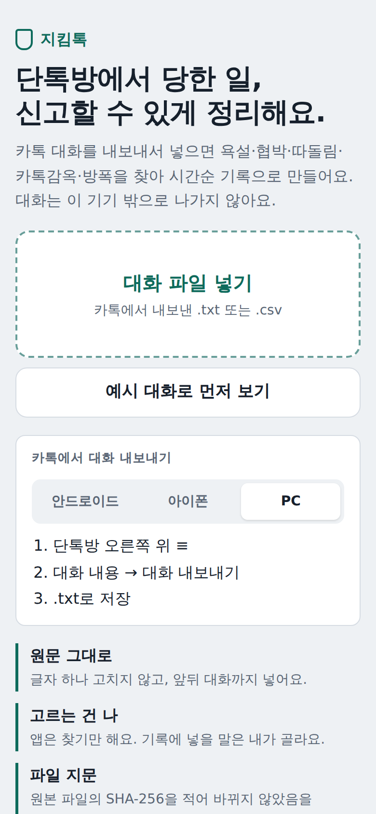
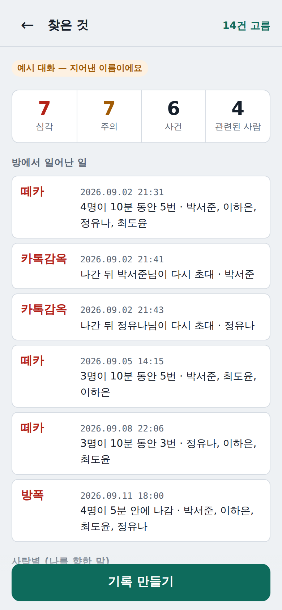
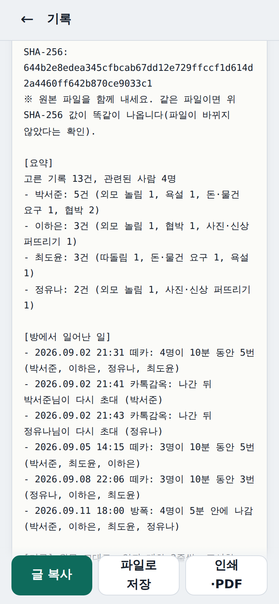

# 지킴톡 — 단톡방에서 당한 일, 신고할 수 있게

카카오톡 단톡방 대화를 **내보내서 넣으면**, 욕설·협박·돈 요구·따돌림·외모 놀림과
**카톡감옥·방폭·떼카**를 찾아 **학교·117에 낼 수 있는 시간순 기록**으로 정리한다.
대화는 기기 밖으로 한 글자도 나가지 않는다.

<p align="center">



</p>

## 문제

- 사이버 학교폭력은 단톡방에서 일어난다. **카톡감옥**(나가도 계속 다시 초대), **방폭**(들어오면 다 나감), **떼카**(여럿이 한꺼번에 욕)는 이름까지 붙은 흔한 방법이다.
- 신고하려면 증거가 필요하다. 교육청·법률 안내는 "대화 내보내기 파일이 시간 흐름을 보여 주는 가장 객관적인 자료"라고 한다. 하지만 수백~수천 줄 파일에서 무엇이 언제 누구에게서 왔는지 **피해 학생이 직접 골라 정리해야** 한다. 같은 욕을 다시 읽는 일이다.
- 학교폭력 담당 선생님도 인쇄된 카톡 수십 쪽을 한 줄씩 읽는다.
- 지금 있는 것: 대화 복구 프로그램, 카톡 통계 앱, 부모가 아이 폰을 감시하는 앱. **피해 학생 손에서, 신고용으로, 기기 안에서** 정리해 주는 도구는 찾지 못했다.

## 하는 일

1. **파일 넣기** — 안드로이드·아이폰·PC·맥에서 내보낸 네 가지 모양을 읽는다. 글자는 한 자도 고치지 않는다.
2. **나 고르기** — 누가 나인지, 나를 부르는 별명이 있는지.
3. **찾은 것 검토** — 유형(죽으라는 말·협박·돈 요구·성적인 말·사진 유포·따돌림·외모 놀림·욕설)과 수준(심각·주의·확인), **왜 표시했는지**, **나를 향한 말로 본 까닭**(이름을 부름 / "너"로 부름 / 내 말 3분 안 / 공격 흐름 3분 안)을 보여 준다. 기록에 넣을지는 **내가 체크**한다.
4. **기록** — 원본 파일 이름·크기·**SHA-256 지문**, 사람별 요약, 방에서 일어난 일, 고른 말과 **앞뒤 대화 2줄**, 원본 파일의 줄 번호. 판단하는 말("가해자", "학교폭력이다")은 쓰지 않는다.

내 말에 "죽고 싶다" 같은 위험 신호가 보이면 **117·1388 번호를 가장 먼저** 보여 준다. 이건 기록에 넣지 않는다.

## 원칙

1. **원문 그대로.** 고치지도, 요약하지도, 지어내지도 않는다. 잘라낸 것처럼 보이지 않게 앞뒤 대화를 붙인다.
2. **찾기는 앱, 판단은 사람.** 앱은 말의 모양만 보고 표시한다. 장난인지 괴롭힘인지는 모른다.
3. **대화는 기기 밖으로 안 나간다.** 서버·계정·분석 도구·외부 글꼴도 없다(화면 테스트가 외부 요청 0건을 확인).
4. **재지 않으면 믿지 않는다.** 나쁜 결과도 그대로 적는다.

## 실측

자세한 건 [`eval/RESULTS.md`](eval/RESULTS.md). 모든 수치는 **학습·규칙 작성에 쓰지 않은 문장**에서 쟀다.

| | 결과 |
|---|---|
| 일상 대화 3,888문장 중 잘못 표시 | **1.13%** (모델 처음엔 28% → 일상 대화를 학습에 넣어 줄임) |
| 공격적인 말을 표시함(재현율) | 욕설 데이터 **85.6%**, 악플 데이터 70.7%, UnSmile 80.5% |
| 표시한 것 중 공격적인 말(정밀도) | 68~89% (규칙만 쓰면 **95~97%**) |
| 기본 체크 | 규칙에 걸리고 나를 향한 말만(정밀도 95% 쪽). 모델만 걸린 말은 직접 고른다 |
| 한 문장 판단 | 기기 안, 1ms 안쪽 / 모델 파일 700KB |

**아직 못 잰 것:** 실제 중·고등학생 단톡방. 공개 데이터는 뉴스·커뮤니티 댓글이라 또래 장난 욕(친한 친구끼리 "ㅅㅂ ㅋㅋ")과 괴롭힘을 가르는 힘은 모른다. 그래서 "나를 향한 말"과 사람의 체크를 둔다. → [`PLAN.md`](PLAN.md)

## 실행

```bash
npm install
npm run dev          # 개발 서버
npm test             # 단위 테스트(해석·규칙·찾기·기록·파이썬과 다듬기 짝 맞춤)
npm run e2e          # 화면 테스트(Chromium): 예시→검토→기록, 파일 넣기, 위험 신호, 폰 폭, 외부 요청 0건
npm run train        # 모델 다시 만들기(model/data에 공개 데이터 필요)
npm run measure      # 규칙+모델 측정표
npm run build        # dist/를 아무 정적 호스팅에 올리면 끝
```

## 구조

```
src/core/parse.ts      카톡 내보내기 4가지 모양 → 메시지(원문·시각·원본 줄 번호)
src/core/detect.ts     유형 규칙 8가지 + 일상어 예외, 나를 향한 말, 카톡감옥·방폭·떼카·강퇴
src/core/model.ts      공격성 점수(글자 n-그램 로지스틱 회귀, 학습은 model/train.py)
src/core/normalize.ts  말 다듬기(시1발→시발, ㅋㅋㅋㅋ→ㅋㅋ). 파이썬과 글자 하나까지 같게
src/core/report.ts     신고용 글 기록, SHA-256
src/main.ts            화면
model/                 학습·검증 스크립트, 공개 데이터
eval/                  측정
```

## 데이터·라이선스

- 코드: MIT
- 모델(`public/model.json`): [kocohub/korean-hate-speech](https://github.com/kocohub/korean-hate-speech)(CC BY-SA 4.0), [2runo/Curse-detection-data](https://github.com/2runo/Curse-detection-data)(MIT), [songys/Chatbot_data](https://github.com/songys/Chatbot_data)(MIT)로 학습 → **CC BY-SA 4.0**
- 검증만: [Smilegate UnSmile](https://github.com/smilegate-ai/korean_unsmile_dataset)(CC BY-NC-ND 4.0, 학습에 안 씀)

## 알려진 한계

- 카톡 내보내기 모양은 버전마다 조금씩 다르다. 흉내 낸 예로 시험했고, 실제 파일로 확인이 필요하다. 못 읽은 줄은 개수를 보여 준다.
- "나를 향한 말"은 이름·"너"·시간으로 추정한다. 다른 사람에게 한 "넌 빠져"도 나를 향한 말로 볼 수 있다. 그래서 체크는 사람이 한다.
- 사진·이모티콘·음성은 내보내기 파일에 글로만 남는다("사진"). 사진 속 괴롭힘은 따로 캡처해야 한다.
- 법적 증거 능력을 보증하지 않는다. 원본 파일과 화면 캡처를 함께 내도록 안내한다.
