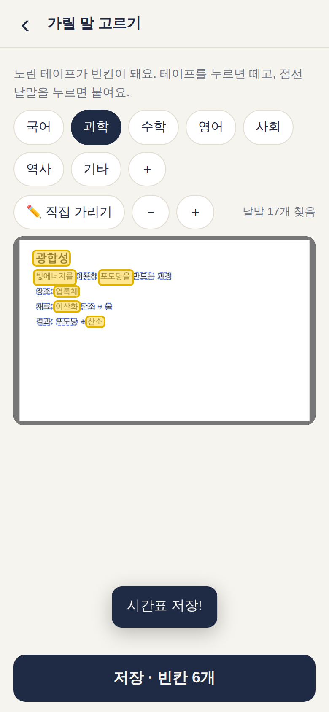
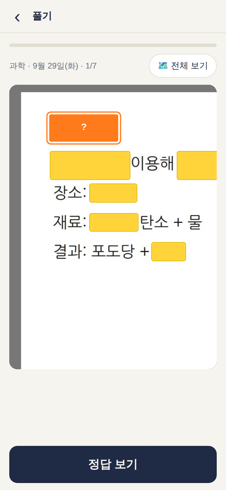
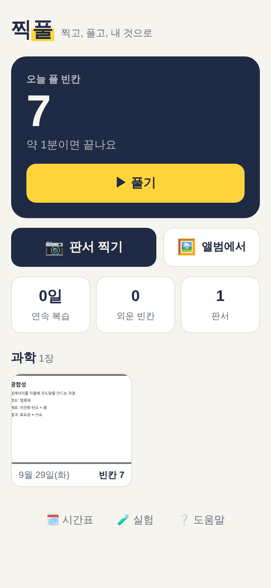

# 찍풀 — 찍고, 풀고

> **"너 맨날 찍기만 하고 안 보잖아."** 그 판서 사진을, 잊을 때쯤 다시 푸는 빈칸 문제로.

수업이 끝나면 칠판을 찍습니다. 그리고 다시 안 봅니다. 사진첩 속 판서는 셀카·밈 사이에 묻히고,
시험 전날에야 수십 장을 넘기며 "이게 무슨 과목이었지?" 합니다.

찍풀은 판서 사진 속 중요한 말에 **노란 테이프**를 붙여 빈칸으로 만들고,
**그날 저녁 → 1일 → 3일 → 7일 → 14일 뒤**에 다시 풀게 합니다.

<p align="center">



</p>

## 왜

| 알려진 것 | 출처 |
|---|---|
| 사진을 찍으면 찍은 대상을 **덜** 기억한다(사진 찍기 손상 효과) | Henkel, *Psychological Science* 2014 |
| 대면 수업에서 슬라이드를 찍은 내용은 필기만 한 것보다 덜 기억났다 | "Snap & Write", 2025 ([PMC](https://pmc.ncbi.nlm.nih.gov/articles/PMC12109291/)) |
| 다시 읽기보다 **떠올려 보기**(시험 보듯 인출)가 일주일 뒤 훨씬 많이 남는다 | Roediger & Karpicke, *Psychological Science* 2006 |
| 한 번에 몰아서보다 **간격을 두고** 복습하면 오래간다 | Cepeda 외, *Psychological Bulletin* 2006 |
| 공부법 10가지 중 효과가 "높음"인 건 **연습 시험**과 **간격 두기** 둘뿐 | Dunlosky 외, 2013 |

사진을 찍는 게 문제가 아닙니다. **찍고 끝나는 게** 문제입니다. 찍풀은 찍은 다음에 해야 할 일,
가장 효과가 좋다고 알려진 두 가지를 학생이 따로 마음먹지 않아도 하게 만듭니다.

## 어떻게

```
📷 수업 끝에 찍는다     → 시간표로 과목이 저절로 정해진다(화 2교시 → 과학)
👆 가릴 말을 확인한다    → 앱이 글자를 찾아 테이프를 추천한다. 틀리면 톡 떼고, 점선 낱말을 톡 붙인다
🧠 알림이 오면 푼다      → 빈칸 둘레를 크게 보여 준다. 떠올린 뒤 "정답 보기" → 😎 알았어 / 😵 몰랐어
```

- 모르는 건 그 자리에서 맞힐 때까지 다시 나오고, 다음 날 또 나옵니다.
- 알았던 건 1·3·7·14·30일로 점점 멀어집니다. 14일 간격을 넘기면 "외운 빈칸"으로 셉니다.

## 다른 것과 무엇이 다른가

| | 사진첩 | 노트 앱(굿노트·노션) | AI 문제 생성 앱 | Anki 가림 카드 | **찍풀** |
|---|---|---|---|---|---|
| 떠올리기 연습 | ✗ | ✗ | ○ | ○ | **○** |
| 간격 복습 | ✗ | ✗ | 일부 | ○ | **○** |
| 문제가 틀릴 수 있나 | – | – | **AI가 지어낸 문제·정답** | 직접 만들면 안 틀림 | **정답 = 선생님 판서 사진** |
| 만드는 수고 | 0 | 다시 필기 | 올리기 | PC에서 상자 그리기 | **찍고 톡톡, 저장 한 번** |
| 한국어 판서 | – | – | 서버 의존 | 영어 위주 | **기기 안 한국어 OCR** |
| 사진이 밖으로 | – | 클라우드 | **서버로 올림** | – | **안 나감, 계정 없음** |

핵심은 **정답이 AI가 쓴 글자가 아니라 사진 그 자체**라는 점입니다. 글자 찾기(OCR)는
"어디를 가릴지"만 돕습니다. OCR이 '엽록체'를 '엽톡제'로 읽어도, 풀 때 열리는 건
선생님이 쓴 '엽록체' 픽셀입니다. **AI가 틀려도 정답은 안 틀립니다.**

## 🧪 우리 반 실험 (앱 안에 들어 있음)

"떠올리기가 더 오래 남는다"는 연구 결과가 **우리 반, 우리 판서에서도** 맞는지 직접 잽니다.

- 실험을 켜면 새 사진의 빈칸을 **반씩** 나눕니다(무작위, 위치 짝지어 균형).
  - 반은 복습 문제로 나옵니다(떠올리기).
  - 반은 복습 때 가려지지 않고 그대로 보입니다(다시 읽기).
- 찍고 7일 뒤 **둘 다 가리고** 한 번씩 묻습니다. 두 쪽의 기억률 차이가 효과입니다.
- **한 사람 안에서 비교**하니 반 친구를 두 무리로 나눌 필요가 없습니다. 이름 없이 CSV로 모읍니다.

## 실측

자세한 표와 방법: [`eval/RESULTS.md`](eval/RESULTS.md). 나쁜 결과도 그대로 적었습니다.

| | 결과 |
|---|---|
| 핵심어를 글자로 찾음(시험용 45장, 한 번도 안 보고 잼) | **88.1%** (정면 슬라이드 100%, 원근·그늘·반사·흐림 82.7%) |
| 추천 테이프가 핵심어를 덮음 | 53.5% (개발용 65.8% → **규칙이 개발용에 맞춰졌다**) |
| 추천 테이프 중 핵심어 | 64.5% |
| 추천이 아껴 주는 누름 | 사진당 1.4번(5.4 → 4.0) — **덤일 뿐, 핵심은 점선 낱말 톡과 "정답은 사진"** |
| OCR 한 장 | 약 0.5초(노드 CPU 1코어) |
| 찍고 나서 저장까지 누름 | 시간표가 있고 추천을 받아들이면 **저장 1번** (시간표 없으면 과목 +1) |
| 밖으로 나간 요청 | **0건** (화면 테스트가 확인) |
| 비행기 모드 | 한 번 연 뒤로 찍기·글자 찾기·풀기 모두 됨(화면 테스트가 확인) |

**아직 못 잰 것:** 진짜 교실 사진, 실제 기억 효과, 폰에서의 속도. 측정 사진은 브라우저로 그린
것이고 손글씨는 글꼴입니다. → [`PLAN.md`](PLAN.md)

## 설치·실행

설치도 계정도 없습니다. 웹 주소를 열고 "홈 화면에 추가"하면 앱처럼 씁니다.

```bash
npm install
npm run dev        # 개발 서버
npm test           # 단위 테스트 (복습 일정·시간표·빈칸 추천·실험 배정·백업)
npm run e2e        # 화면 테스트: 진짜 Chromium에서 찍기→가리기→풀기→실험→백업→오프라인
npm run build      # dist/ 를 아무 정적 호스팅(GitHub Pages 등)에 올리면 끝
```

## 구조

```
src/core/          의존성 없는 순수 로직(모두 단위 테스트)
  blanks.ts        가릴 말 추천: 제목·쌍점 앞뒤·숫자+단위·되풀이·줄 끝 명사, 조사 떼기
  ocrWords.ts      tesseract 결과 → 낱말. 쪼개진 한국어 글자를 줄 띄어쓰기에 맞춰 잇기
  schedule.ts      간격 반복(3시간·1·3·7·14·30·60일)
  timetable.ts     찍은 시각 → 과목(끝나고 10분까지 그 수업)
  experiment.ts    한 사람 안 비교 실험: 짝지은 무작위 배정, 요약, CSV
  ics.ts           서버 없는 복습 알림(캘린더 반복 일정)
src/ocr.ts         tesseract.js(한국어 데이터 앱에 동봉, CDN 안 씀)
src/db.ts          IndexedDB(사진·빈칸·시간표), 백업 내보내기/가져오기
src/main.ts        화면
eval/              측정 사진 만들기·OCR·추천 측정
tests/             단위 테스트, e2e/ 화면 테스트
```

## 알려진 한계

- **알림**: 웹앱은 서버 없이 정해진 시각에 푸시를 못 보냅니다. 대신 캘린더에 매일 복습 일정을 넣습니다(도움말 화면).
- **손글씨**: 흘려 쓴 판서는 글자를 못 찾을 수 있습니다. 그땐 손가락으로 끌어 직접 가립니다. 정답은 사진이라 풀기엔 지장이 없습니다.
- **스스로 채점**: "알았어/몰랐어"는 정직함에 기댑니다. 실험에선 두 쪽에 똑같이 적용되니 차이는 비교할 수 있습니다.
- **기기 안에만 저장**: 폰을 바꾸면 백업 파일로 옮겨야 합니다(도움말 → 내보내기).
